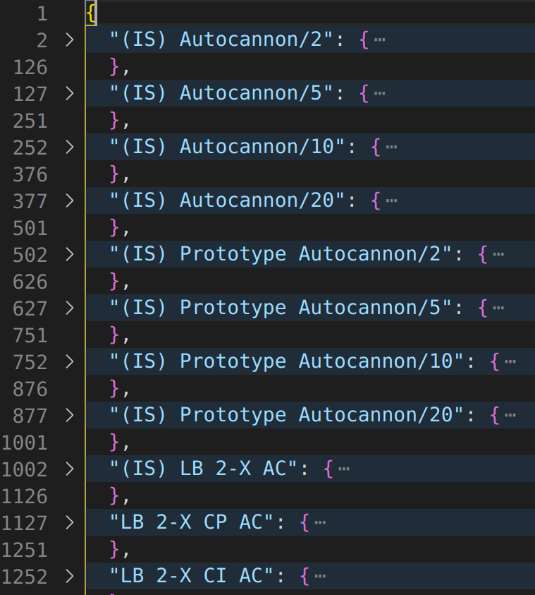

# Custom Equipment Guide
SSW 7.4 has introduced a new process for creating and managing custom equipment. Mainly, the `Equipment.ods` spreadsheet
and legacy `.dat` files have been removed. The `.dat` files have been replaced with corresponding `.json` files, which you 
can now edit directly and have the changes reflected in SSW (see notes below) without having to run the binconvert 
application to convert from spreadsheet to binary. 

## Migrating Custom Equipment From 7.3 and Earlier
If you don't have any custom equipment then there is nothing you need to do. Otherwise, please read this section carefully
so you can migrate your equipment to the new format used by SSW 7.4 and newer.

First, 4 new columns have been added to the end of `Custom Equipment.ods`, which are meant to more consistently describe
the item so that SSW can deal with it in a logical way. Note that these changes only apply to the "Ranged Weapons" tab.

**Weapon Type**: The general type of weapon. Allowed values:
```
AUTOCANNON, GAUSS, TASER, RIFLE, MG, FLUID_GUN, ARTILLERY_CANNON, LASER, PPC, PLASMA_RIFLE, PLASMA_CANNON, TSEMP, FLAMER, 
ATM, LRM, MML, MRM, SRM, ROCKET_LAUNCHER, NARC, MORTAR, THUNDERBOLT, LRT, SRT, ARROW_IV, CRUISE_MISSILE, OTHER
```
**Variant**: The general variant of the weapon. Allowed values:
```
BASE, PROTOTYPE, LBX, LIGHT, MEDIUM, HEAVY, IMPROVED_HEAVY, PROTOMECH, ROTARY, ULTRA, HYPER_VELOCITY, ANTI_PERSONNEL, 
IMPROVED, HYPER_ASSAULT, LONGTOM, SNIPER, THUMPER, ER, PULSE, X_PULSE, ER_PULSE, VARIABLE_SPEED_PULSE, CHEMICAL, 
REENGINEERED, STREAK, PENTAGON_POWER, ENHANCED, EXTENDED, VEHICLE, RISC, OTHER
```
**Size Class**: The size class of the weapon (if applicable). Note that light and heavy are considered variants, not size classes. 
Use na if none of these apply. Allowed values:
```
micro, small, medium, large, na
```
**Rack Size**: The rack size for ACs and Missile weapons (e.g. `5` for LRM5). Use `0` if not using a weapon with a rack size.

Fill out these values for all of your custom equipment in `Custom Equipment.ods`. When finished, export the sheet as
to CSV using the same process as before, making sure to use `;` as the delimeter and naming it correctly `custom_weapons.csv`.
Then, launch `binconvert.jar`, select the file and appropriate equipment type and click `Convert` to convert it to the
legacy binary format.

Next, click the file selection box again, and within the file explorer, click the extension dropdown at the bottom to 
change the extension to `*.dat`. Then navigate to your newly created `custom_weapons.dat` file, select it, and click the
`JSON` button on the bottom left to convert it to the new JSON format. Do this for each of your custom equipment types.
Afterwards, your new equipment should load into SSW.

## Customizing Equipment
A modern text editor such as [Visual Studio Code](https://code.visualstudio.com/) or [Notepad++](https://notepad-plus-plus.org/) 
is recommended for editing the equipment files, since they allow you to collapse the JSON objects to make navigation far
easier.

First, after opening the selected equipment file, collapse all fields with `Ctrl + k + 0` (VS code, `Alt + 0` in Notepad++).
You can then click the arrows on the left hand side (next to the line numbers) to expand the weapon you want to edit:

 

Most fields should be self-explanatory, and roughly mirror the fields in the spreadsheet although the order may
be different. Simply edit the fields to set the values you want, but make sure to keep the structure consistent (no quotes
around `true` or `false`, commas after each value, etc.). To add new equipment, we recommend copying an existing piece of
similar equipment and pasting it in after the end of a previous entry. Note that a complete entry starts with the LookupName
followed by curly brace, and ends with a closing curly brace:

```
"(IS) Prototype Autocannon/5": {
    "ActualName": "Prototype Autocannon/5",
    "CritName": "Prototype AC/5",
    "MegaMekName": "ISAC5",
    "LookupName": "(IS) Prototype Autocannon/5",
    "ChatName": "PTAC5",
    "Specials": "S",
    "Type": "DB",
    "ModifiedType": "DB",
    "BookReference": "Jihad Secrets: The Blake Documents",
    "type": "AUTOCANNON",
    "variant": "PROTOTYPE",
    "sizeClass": "NA",
    "HasAmmo": true,
    "SwitchableAmmo": true,
    "RequiresFusion": false,
    "RequiresNuclear": false,
    "RequiresPowerAmps": false,
    "Alloc_HD": true,
    "Alloc_CT": true,
    "Alloc_Torso": true,
    "Alloc_Arms": true,
    "Alloc_Legs": true,
    "alloc_front": true,
    "alloc_sides": true,
    "alloc_rear": true,
    "alloc_turret": true,
    "alloc_body": false,
    "CanSplit": false,
    "OmniRestrict": true,
    "LocationLinked": false,
    "Rotary": false,
    "Ultra": false,
    "IsCluster": false,
    "Explosive": false,
    "Streak": false,
    "OneShot": false,
    "CanUseFCS": false,
    "TCCapable": true,
    "ArrayCapable": false,
    "CanUseCapacitor": false,
    "CanUseInsulator": false,
    "CanUsePulseModule": false,
    "CanUseCaseless": false,
    "CanOS": false,
    "CanIOS": false,
    "Heat": 1,
    "DamSht": 5,
    "DamMed": 5,
    "DamLng": 5,
    "RngMin": 3,
    "RngSht": 6,
    "RngMed": 12,
    "RngLng": 18,
    "ToHitShort": 0,
    "ToHitMedium": 0,
    "ToHitLong": 0,
    "AmmoLotSize": 15,
    "NumCrits": 4,
    "CVSpace": 1,
    "AmmoIndex": 155,
    "ClusterSize": 5,
    "ClusterGroup": 1,
    "ClusterModShort": 0,
    "ClusterModMedium": 0,
    "ClusterModLong": 0,
    "CaselessAmmoIDX": 0,
    "FCSType": 0,
    "WeaponClass": 0,
    "RackSize": 5,
    "Tonnage": 8.0,
    "Cost": 125000.0,
    "OffBV": 70.0,
    "DefBV": 0.0,
    "Availability": {
      "IS_SL": "E",
      "IS_SW": "X",
      "IS_CI": "X",
      "IS_DA": "X",
      "IS_TechRating": "C",
      "CL_SL": "X",
      "CL_SW": "X",
      "CL_CI": "X",
      "CL_DA": "X",
      "CL_TechRating": "X",
      "IS_RandDStartDate": 0,
      "IS_PrototypeDate": 0,
      "IS_IntroDate": 2240,
      "IS_ExtinctDate": 2800,
      "IS_ReIntroDate": 0,
      "CL_RandDStartDate": 0,
      "CL_PrototypeDate": 0,
      "CL_IntroDate": 0,
      "CL_ExtinctDate": 0,
      "CL_ReIntroDate": 0,
      "RulesLevelBM": 4,
      "RulesLevelIM": 4,
      "RulesLevelCV": 4,
      "RulesLevelAF": 4,
      "RulesLevelCF": 4,
      "TechBase": 0,
      "IS_IntroFaction": "TH",
      "IS_ReIntroFaction": "--",
      "IS_RandDFaction": "--",
      "IS_PrototypeFaction": "--",
      "CL_IntroFaction": "--",
      "CL_ReIntroFaction": "--",
      "CL_RandDFaction": "--",
      "CL_PrototypeFaction": "--",
      "IS_WentExtinct": true,
      "IS_ReIntroduced": false,
      "IS_IsPrototype": false,
      "CL_WentExtinct": false,
      "CL_ReIntroduced": false,
      "CL_IsPrototype": false,
      "PBMAllowed": true,
      "PIMAllowed": true,
      "PrimitiveOnly": false,
      "SuperHeavyCompatible": true,
      "SuperHeavyOnly": false
    },
    "BattleForceAbilities": [
      "-"
    ]
  },
```
A trailing comma is required unless it's the last item in the file. As with the spreadsheet, the LookupName must be unique.

After you've made your edits, save the file and start SSW. If you're editing while SSW is running, you can click "Reload
Equipment" in the Tools menu to refresh the equipment lists with the new stats.