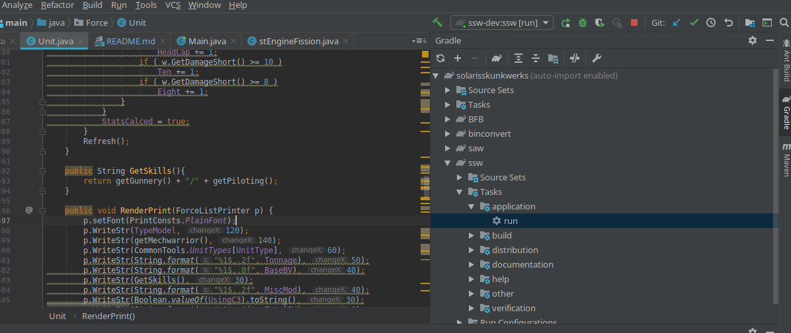

# Solaris Skunk Werks
Solaris Skunk Werks is a community-supported tool used to design Battlemechs for use with the Battletech tabletop wargame.

## Getting Started
Download the [latest release](https://github.com/Solaris-Skunk-Werks/solarisskunkwerks/releases) and extract it into the
desired directory. You can then launch the various applications by double clicking them or from the command line with 
`java -jar SSW.jar`.  More detailed install instructions can be found in [this repository's wiki](https://github.com/Solaris-Skunk-Werks/solarisskunkwerks/wiki/How-to-download-and-install-the-SSW-apps)

## Building From Source
This project uses the gradle build system and requires gradle to be installed to be able to compile from source. If you 
intend to develop the project with an IDE, you'll need one with gradle support. Intellij IDEA and Netbeans 11.x have been
tested and both have gradle support out of the box. Netbeans earlier than 11.x should work but you may need to install the 
gradle plugin.

To build the full suite of applications on the command line, run the following gradle task (substitute `.\gradlew.bat` in all of these commands 
if you're on Windows):

```
$ ./gradlew releaseBuild
```
This will compile all of the applications and dependencies and place them in `build/release/SSW_-<version>`.

To build a release zip containing all of the applications:

```
$ ./gradlew zipRelease
```

This will create a zip file containing all applications in the SSW suite under `build/distributions`. Simply unzip that
file wherever you want to install it.

These tasks can also be ran directly from Intellij IDEA and Netbeans by selecting the task from the Gradle tasks section
of the UI:


### Development
To build and run SSW directly from the command line during development:

```
$ ./gradlew ssw:run // Compile and run a dev build of ssw
$ ./gradlew saw:run // Compile and run a dev build of solaris armor werks
$ ./gradlew bfb:run // Compile and run a dev build of battletech-force-balancer
```

Note that all gradle tasks can also be ran directly from the IDE if you aren't comfortable with the command line. In
Netbeans 11, the gradle tasks appear in the bottom left portion of the screen. In Intellij, the gradle menu should be in
the top right:



After you run a subproject using the gradle menu once, it will appear at the top of the screen for easier access later:


To debug in IDEA, first run the target application once using the gradle menu as shown above. After it appears in the quick menu
at the top, click the debug icon. Debugging in Netbeans is similarly straightforward.

## Contributing
SSW's development workflow generally follows the git workflow described [here](https://www.atlassian.com/git/tutorials/comparing-workflows/gitflow-workflow). 
In summary:

1. Fork this repository and clone your copy locally.
2. If you're implementing a bug fix, checkout the `hotfix` branch.
3. If you're implementing a new feature, checkout the `develop` branch.
4. Create a new branch and commit your changes, then submit a pull request. Features should be merged into `develop` while 
bug fixes should be merged into `hotfix`.

Feel free to join our [Discord Server](https://discordapp.com/invite/xc5pUWP) to ask questions, report bugs or help with 
QA testing.
